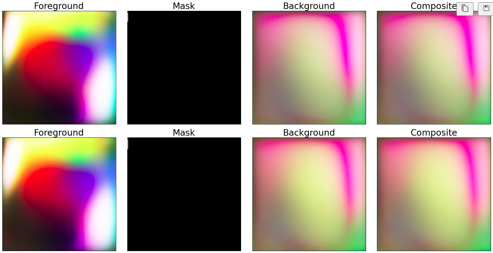

# [FurryGAN: High Quality Foreground-aware Image Synthesis](https://www.ecva.net/papers/eccv_2022/papers_ECCV/papers/136740679.pdf)

Jeongmin Bae, Mingi Kwon, and Youngjung Uh

*ECCV 2022*

<p align="center">
    
    <p>Figure: Sampling Results</p>
</p>


This folder provides a re-implementation of this paper in PyTorch, developed as part of the course METU CENG 796 - Deep Generative Models. The re-implementation is provided by:

* Batuhan Bal, bal.batuhan@metu.edu.tr 
* Onat Özdemir, onat.ozdemir@metu.edu.tr

Please see the jupyter notebook file [main.ipynb](main.ipynb) for a summary of paper, the implementation notes and our experimental results.

## Requirements

This project is tested on Python 3.10.10. To install dependencies:
```
pip install -r requirements.txt
```

## Downloading the dataset

Download the dataset:
```
bash download_data.sh
```

## Testing and training

To test and train:
```
python main.py
```
