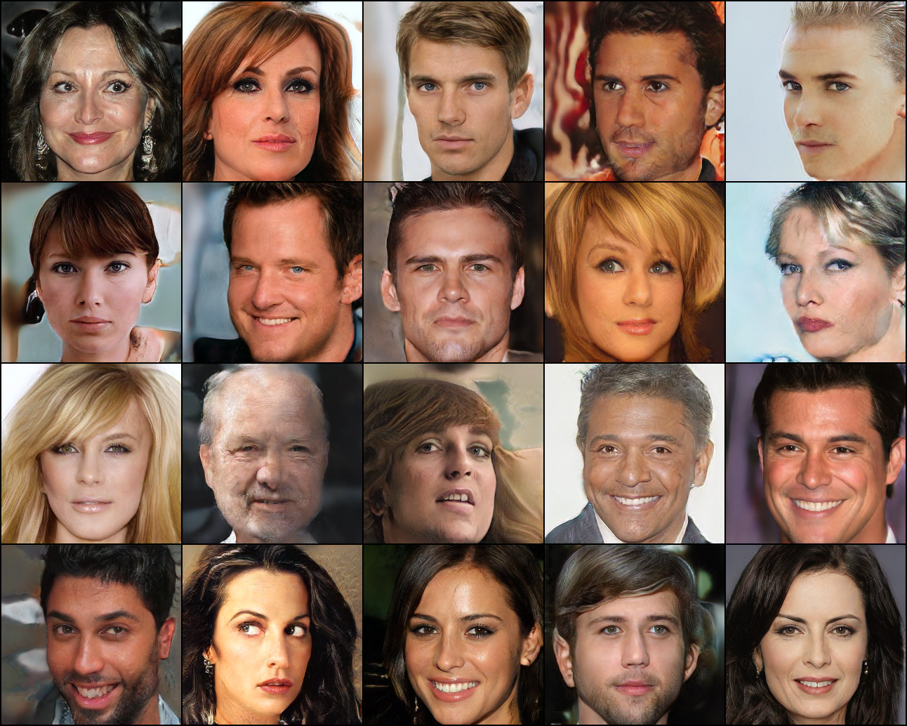

# [Multi-View Consistent Generative Adversarial Networks for 3D-aware Image Synthesis](https://arxiv.org/pdf/2204.06307.pdf)

Xuanmeng Zhang, Zhedong Zheng, Daiheng Gao, Bang Zhang, Pan Pan, Yi Yang
CVPR 2022

This folder provides a re-implementation of this paper in PyTorch, developed as part of the course METU CENG 796 - Deep Generative Models. The re-implementation is provided by:
* Egemen Sert, egemen.sert@metu.edu.tr

Please see the jupyter notebook file [main.ipynb](main.ipynb) for a summary of paper, the implementation notes and our experimental results.
